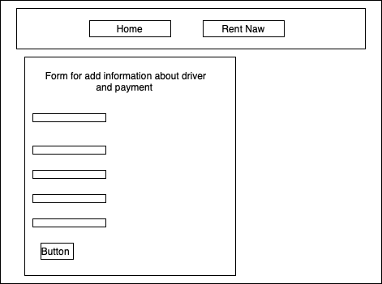
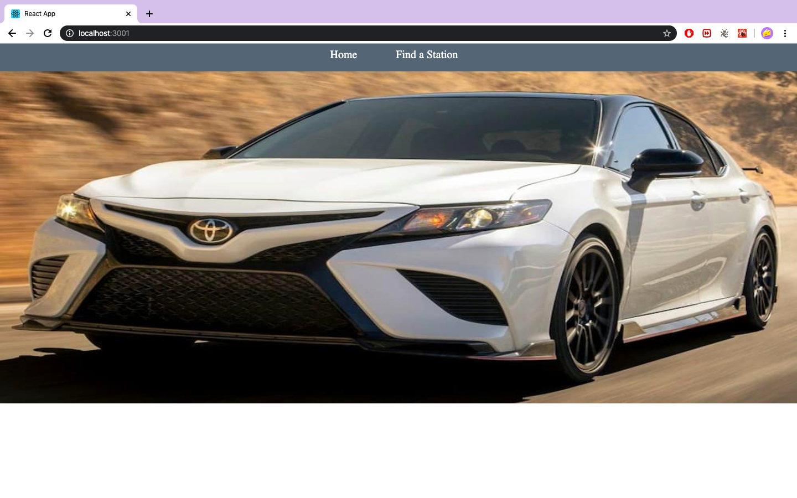
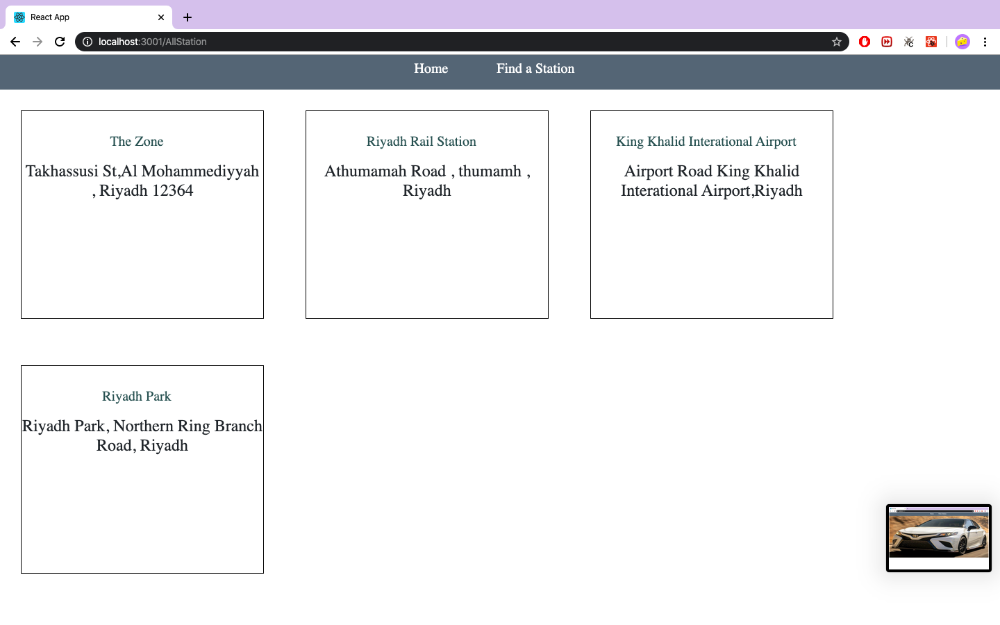
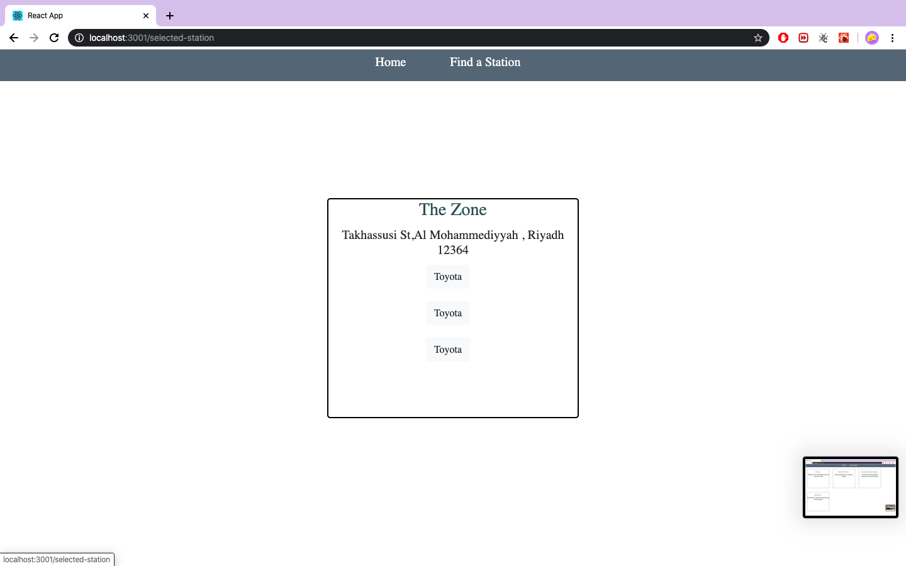
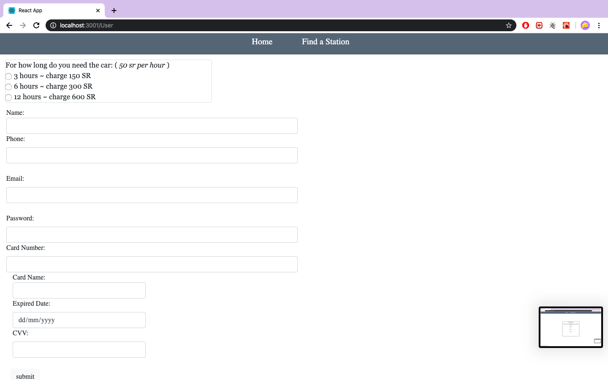
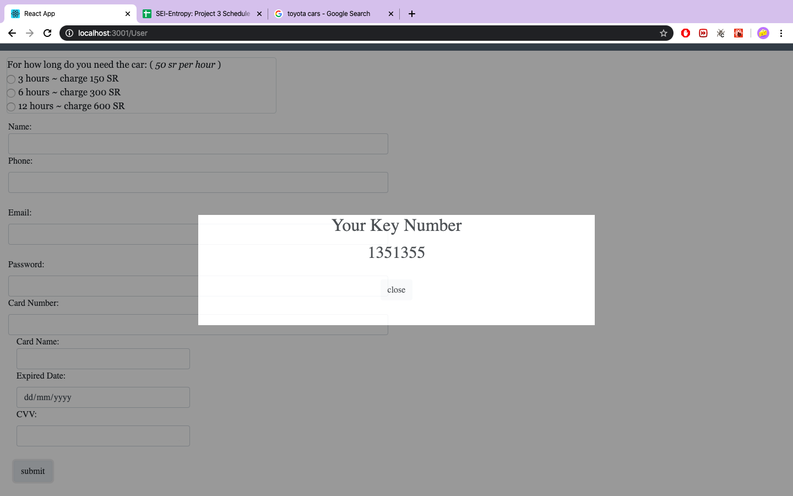

## Car Rent

### Usar Story :

<li> As a Company, has cars in a city.
<li>As a Company, has stations
<li>As a company, generate a password as a car's key 
<li>As a company, when payment done show Message to the user has the key password of the car.
<li>As station, get all cars shows when user select specific location.
<li>As station, update the car status when car is reserved.
<li>As station, remove the car from station when generate the key password to the user.
<li>As a user , if there is an available car ,in selected location, he can rented.
<li>As a user, select 3 types of rental base of hours per rent (3 hours - 6 hours - 12 hours)
### Wireframes:
Home page :
 

 
Station Page:
 

 
User information and payment page :
(User.png)
 

## Front End
Home page :
 

Station Page:
 

User information and payment page :
 

### List of technologies used in this project:
<li>React
<li>MongoDB
<li>Mongoose
<li>Express
<li>VS code
<li>Postman
### Unsolved proplem:
Signi
